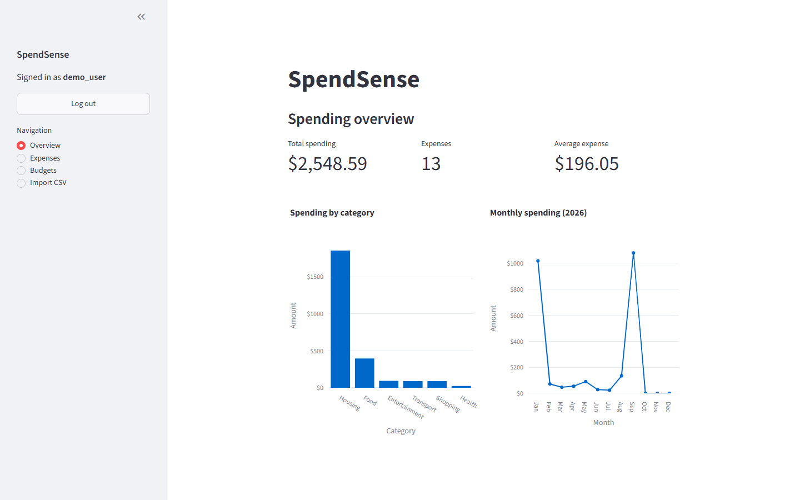

# SpendSense

SpendSense is a personal finance app for recording expenses, setting monthly category budgets, and understanding where money is being spent. It has a Streamlit dashboard backed by a FastAPI API and a PostgreSQL database.

[Open the live app](https://spendsense-finance.streamlit.app) · [View the API documentation](https://spendsense.fastapicloud.dev/docs)



## Features

- Create an account and log in securely
- Add, edit, and delete expenses
- Organize expenses with standard or custom categories
- Set monthly spending limits for each category
- Track spending, remaining budget, and budget warnings
- Find expenses that do not have an allocated budget
- View spending totals and monthly and category charts
- Import expenses from CSV files while skipping duplicates

## Tech stack

| Area | Technology |
| --- | --- |
| Frontend | Streamlit, Pandas, Plotly |
| Backend | FastAPI, Pydantic |
| Database | PostgreSQL in production, SQLite for local development |
| ORM and migrations | SQLAlchemy, Alembic |
| Authentication | JWT, Argon2 password hashing |
| Hosting | Streamlit Community Cloud, FastAPI Cloud, Neon |
| Testing | Pytest |

## How it works

The Streamlit frontend sends requests to the FastAPI backend. FastAPI handles authentication and business logic, while SQLAlchemy reads and writes data in the database. Each expense and budget belongs to the signed-in user.

```text
Streamlit frontend → FastAPI API → SQLAlchemy → PostgreSQL / SQLite
```

## Run locally

SpendSense requires Python 3.13.

1. Clone the repository and enter the project directory.

   ```bash
   git clone https://github.com/sajal-devkota/SpendSense.git
   cd SpendSense
   ```

2. Create and activate a virtual environment.

   **Windows PowerShell**

   ```powershell
   python -m venv .venv
   .\.venv\Scripts\Activate.ps1
   ```

   **macOS or Linux**

   ```bash
   python3 -m venv .venv
   source .venv/bin/activate
   ```

3. Install the dependencies.

   ```bash
   pip install -r requirements.txt
   ```

4. Copy `.env.example` to `.env`. Generate a secret key with the command below, then replace the placeholder value in `.env`.

   ```bash
   python -c "import secrets; print(secrets.token_urlsafe(48))"
   ```

   The default database URL uses a local SQLite file, so PostgreSQL is not required for local development.

5. Apply the database migrations.

   ```bash
   python -m alembic upgrade head
   ```

6. Start the API.

   ```bash
   fastapi dev
   ```

7. In a second terminal, activate the virtual environment and start the frontend.

   ```bash
   streamlit run streamlit_app.py
   ```

The frontend opens at `http://localhost:8501`, and the API documentation is available at `http://127.0.0.1:8000/docs`.

## CSV imports

CSV files must contain `date`, `title`, and `amount` columns. The `description`, `category`, and `transaction_id` columns are optional.

```csv
date,title,amount,description,category,transaction_id
2026-09-01,Coffee,5.00,Morning coffee,food,txn-001
2026-09-02,Bus fare,2.50,Trip to campus,transport,txn-002
```

SpendSense validates each row and reports imported, duplicate, and failed records separately.

## Tests

Run the test suite from the project root:

```bash
python -m pytest -q
```

The tests cover user accounts, authentication, expenses, budgets, CSV imports, API requests, and the main frontend workflows.

## Deployment

The project is deployed as three connected services:

- Streamlit Community Cloud hosts the frontend.
- FastAPI Cloud hosts the API.
- Neon provides the PostgreSQL database.

The frontend receives the backend address through `API_URL`. The backend receives `DATABASE_URL` and `SECRET_KEY` through its environment settings. These values are stored by the hosting platforms and are not committed to the repository.
